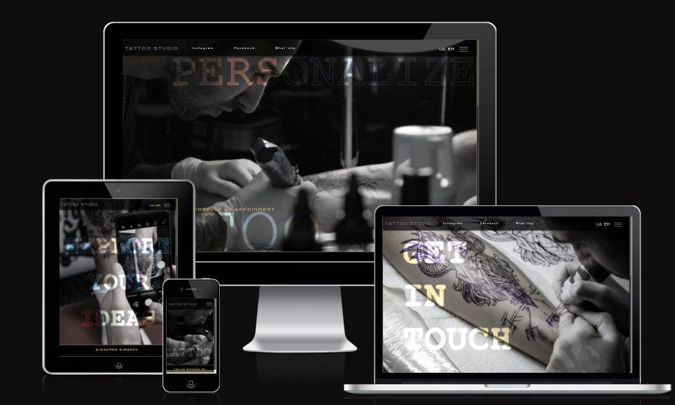

# Welcome to Kingdom Of Shadows!

This website is designed for a [tattoo studio](https://denysrudenko.github.io/Project-1.-Tatto-studio./).

## Introduction
**Kingdom of Shadows** is a tattoo studio that provides variety of services for the clients. The owner is a talented experienced artist, who now wants to attract clients via Internet. As we know having a website is not a key to successful growth, but excellent presentation is. So for me as for developer it is extremely important to define the philosophy of the business and present the work of the studio.

## Table of Contents 

# Table of Contents
 [1. Who will be interested in visiting the website?](#interested)
    - [User experience:](#user-exp)
    - [User Goals:](#user-goals)
    - [User Expectations:](#user-expectations)
  

# 1. Who will be interested in visiting the website?
  [Go to the top](#table-of-contents)
* potential clients of the studio 
* people looking for inspiration and new technics 
* professionals working in the same industry 
* people, who want to learn more about the technology of tattooing 

## 1.1 User experience 
   [Go to the top](#table-of-contents)

In modern world respectful business must have an on-line page to grow. This especially applies to the tattoo salons, because it is a number one wish for the clients to assure themselves that their expectations meet the reality. 

## 1.2 User Goals
  [Go to the top](#table-of-contents)
My main goal during the project was creation of the strong image of the studio, creating a portfolio to back up the description and giving an overview of the tattooing process. 

## 1.3 User Expectations
The website contents the information about studio, background of the artist and detailed description of the styles he uses, services available there, feedback from the clients, contact info. Here is what user is able to do within the website:
* all pages are easily accessible 
* the interface is easily navigated 
* responsive design for all screen/device sizes
* links to the messengers to contact the studio

