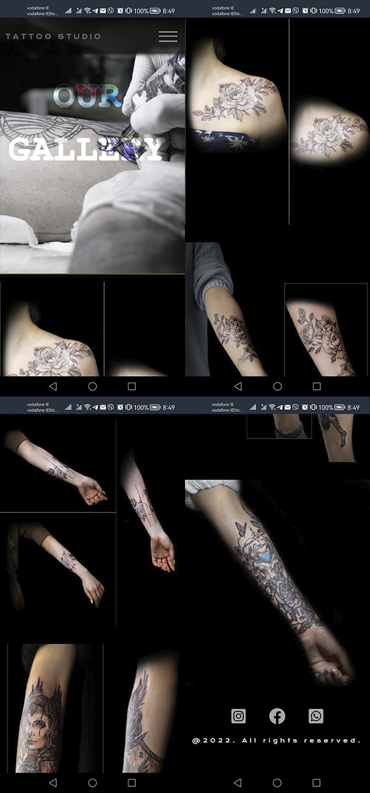

# Welcome to Kingdom Of Shadows!

This website is designed for a [tattoo studio](https://denysrudenko.github.io/Project-1.-Tatto-studio./).

## Introduction
**Kingdom of Shadows** is a tattoo studio that provides variety of services for the clients. The owner is a talented experienced artist, who now wants to attract clients via Internet. As we know having a website is not a key to successful growth, but excellent presentation is. So for me as for developer it is extremely important to define the philosophy of the business and present the work of the studio.

## Table of Contents 

# Table of Contents
 [1. Who will be interested in visiting the website?](#interested)
    - [User experience:](#user-exp)
    - [User Goals:](#user-goals)
    - [User Expectations:](#user-expectations)
    -	[Colour scheme and font](#color-scheme)
    - [Audio/video controls](#audio-video)
    - [Site skeleton (wireframes)](#wireframes)
     - [Introduction page](#introduction-page)
     - [Result](#result)
 
 [2. Features](#features)

 [3.Technologies used](#technologies-used)

 [4.Testing](#testing)

 [5.Bugs](#bugs)

 [6. GitHub](#git)

 [7. Information](#acknowledgement)

 [8. Future](#future)

  

# 1. Who will be interested in visiting the website?
  [Go to the top](#table-of-contents)
* potential clients of the studio 
* people looking for inspiration and new technics 
* professionals working in the same industry 
* people, who want to learn more about the technology of tattooing 

## 1.1 User experience 
   [Go to the top](#table-of-contents)

In modern world respectful business must have an on-line page to grow. This especially applies to the tattoo salons, because it is a number one wish for the clients to assure themselves that their expectations meet the reality. 

## 1.2 User Goals
  [Go to the top](#table-of-contents)

My main goal during the project was creation of the strong image of the studio, creating a portfolio to back up the description and giving an overview of the tattooing process. 

## 1.3 User Expectations
   [Go to the top](#table-of-contents)

The website contents the information about studio, background of the artist and detailed description of the styles he uses, services available there, feedback from the clients, contact info. Here is what user is able to do within the website:
* all pages are easily accessible 
* the interface is easily navigated 
* responsive design for all screen/device sizes
* links to the messengers to contact the studio

## 1.4 Color Scheme
  [Go to the top](#table-of-contents)

The choice of the color scheme for the website promoting a business like this plays a huge role in creating the image of the studio in user's eyes. In this design I used Webkit to adjust colors.I style the scroll bar and made a lot of hover effects.

Example:
* background: -webkit-linear-gradient(#bba14f, #f7ef8a, #d2ac47, #edc967);
*   -webkit-background-clip: text;
*   -webkit-text-fill-color: transparent;

## 1.5 Audio-Video-Images
  [Go to the top](#table-of-contents)

Informative and qualitative content for business is one of the best ways to present the work it does. Examples of the work for tattoo saloons are the bridge between klients and business, since many people decide to attend a studio based on the already made designs. My mission was to provide visitors with high resolution pictures, that can be seen and analyzed by the client making a decision. It was also important to display as many different pictures of tattoos as possible, to show divers designs, that artist can do.

What i did?
* Each background image was edited with width and height.
* Each background image was styled with a different style.
* The text of background images were moved for the user accessibility.

## 1.5 Site Skeleton
  [Go to the top](#table-of-contents)

[Wireframe](https://wireframe.cc/) was used to create wireframes of the website. This was very useful as you can quickly make an example of your website.

## Introduction Page

### Desktop
   [Go to the top](#table-of-contents)

* Home page

* Gallery page

* Contact page

### Mobile
   [Go to the top](#table-of-contents)

* Home page

* Gallery page

* Contact page

## Result

### Desktop

* Home page

* Gallery page

* About page

* Contact page

### Mobile

* Home page

* Gallery page

* About page

* Contact page

  
# 2. Features
  [Go to the top](#table-of-contents)
 ### All 4 pages:

#### Header contains:
* Logo
* Social links
* Menu button

#### Social links:  
Social media links (for Facebook, Instagram and WhatsUp) are placed at the top and the bottom of the each page in the header and footer. All the links will open in a new tab. In mobile version the top social links is disabled by using:
* display: none;

I decided to place them there becouse i was trying to make the similar design as [here](https://dribbble.com/shots/11360956--84-2-Shots-for-Practice/attachments/2973440?mode=media).

Back to home link provided to each page at the top left corner. This will allow the user to access to the home page in one click.

#### Navigation bar: 
Placed at the top right corner in menu button. I read a lot of material to develop it, i took from one of examples [here](https://freefrontend.com/css-hamburger-menu-icons/). The style of code was changed and edit for my purposes. There was a lot of work making that without a JavaScript.

#### Languages:
Website contain 2 different languages:
* English
* Ukrainian

#### Drop down menu bar: 
Slided from the left side and contains :
* Home
* Gallery
* About us
* Contact us

#### Logo:
Tattoo Studio is placed on the top left corner and has an active selector which changes the color.

#### Background color:
Background color of header is trasparent.

### Home page:
- Atirst image is included just below the menubar to highlight that this website provides a tattoo sketches. 
- The page contains 3 blocks of infromation : "Tatto Studio in Kyiv", "Garanties", "Feedback".
 Each block contain information about it and image/video provided.
- An external link "SCHEDULE AN APPOINMENT" provided where interested users can apply for a tattoo. The link has a hover effect.

### Gallery page:
- Gallery image just bellow the menubar.
- Page contain one block with a 8 photos of tattoo.

### About us page:
- Gallery image just bellow the menubar.
- Page contaion two blocks of information.
- 1st block of information about the artist "Alexandr Simakov"
- 2nd block of information about "Instruments and materials"

### Contact us page:
- Page contain one block with 2 differend sections.
- 1st section is a form where user can send his infromation and apply for a session.
- 2nd section is a location information with map, adress and contact details.
- If you want to send an email you could press a link with an email.See the photo bellow:

* Unfortunately the map details i hide at mobile version due not enough of time to style to finish the project till 30th of June.

- The form use the method="POST" action="https://formdump.codeinstitute.net/"

I made "WhatsUp" link at the top and at the bottom page to help user the fastest way to contact the artist of the studio. If user click on that link, he immediately will redirect to "WhatsUp" chat.

See the pictures below:

"Open xdg-open" this means that google chrome asking you a permission
to open an application on Ubuntu/Debian operation systems.

 
# 3. Technologies Used
  [Go to the top](#table-of-contents)

* [HTML5](https://en.wikipedia.org/wiki/HTML5) (markup language) was used for structuring and presenting content of the website.

* [CSS3](https://en.wikipedia.org/wiki/CSS) (Cascading Style Sheets) was used to provide the style to the content written in a HTML.

* [Wireframe](https://wireframe.cc/) was used to create wireframes of the website.

* [Google Fonts](https://fonts.google.com/) was used to import font-family 'Krona One' into style,css file and which was used throughout the pages of the website.

* [Adobe Photoshop](https://www.adobe.com/uk/products/photoshop.html) was used to resize some of the site images and style them.

* [Font Awesome](https://fontawesome.com/) was used to improt icons to the sites.

* [Chrome](https://www.google.com/intl/en_uk/chrome/) was used to debug and test the source code using HTML5 as well as to test site responsiveness.

* [Github](https://github.com/) was used to create the repository and to store the cproject's code after pushed from Git.

* [Visual Studio](https://code.visualstudio.com/) was used as code generator. I installed ssh for a comfortable work.

* Extensiions for visual studio, see the photo below:

# 4. Testing
  [Go to the top](#table-of-contents)

## 4.1 Testing using tools

### 4.1.1 Google Developer Tools
I make use of google developer tools (Chrome DevTools). 

### 4.1.2 Responsive Tools

In order to make sure that design web pages are responsive, [Am I Responsive](http://ami.responsivedesign.is/) site was used to check it. 
Also checked with a mobile phone Huawei p40 lite.

### 4.1.3 W3C Validator Tools

[W3C Markup](https://validator.w3.org/#validate_by_input+with_options)  I used to check for any errors with my HTML pages.

See the pictures below:

The HTML checker notified me an error in my index.html page at the start of the project, in short words i remember that for "section" i should use h1 - h6 headings, only "div" elements could be fine without headings. Also i had a problem in my contact-us.html with a form. I forgot to make "for" atribute in label for "subject" input. 

[W3C CSS Validation](https://jigsaw.w3.org/css-validator/) was used to check for any error within my css file. I have no errors but i have warnings becouse of "-Webkit". Like it says in the documentary over [here](https://developer.mozilla.org/en-US/docs/Web/CSS/::-webkit-scrollbar)

* ::-webkit-scrollbar is only available in Blink- and WebKit-based browsers (e.g., Chrome, Edge, Opera, Safari, all browsers on iOS, and others). A standardized method of styling scrollbars is available with "scrollbar-color" and "scrollbar-width".

which i have done all over the project with the hover effects for text, footer logos and scrollbar. I decided to keep it, but i understand this is the bad rule for the future development. I noticed that issue on the end of the project, so i keep that in mind.

See the pictures below:

## 4.2 Tests

My problem of the whole project that all images were a big size. For that reason whole pages take a while to load. All depends from the user internet speed. So the percentage of performance is highly variable.
To solve that problem read the "Future".

See the picture below:

# 5. Bugs
  [Go to the top](#table-of-contents)

  ### Solved bugs
- The main problem for me it was making the website responsive. I take a big jump ahead for developing this website. So it took a lot of time actually.
- I also discovered if you using percentage for images, there is a way better to make it responsive, for the whole project i was making the property in pixels, and only at the end i changed to percentage. 
- For the start of the project i deployed the slideshow at "Feedback" section, but when i tried to make it responsive whole slideshow broke up.
The width was using pixels, with a maths formula i was changing the size of the screen to make it responsive, but when i tried to change it to percentage whole slideshow broke up.

See the gif bellow:

I couldn't reach the fix, so i get rid of it. Im sure, for the working slideshow i was needed to add overflow: hidden

- The other bugs i had, that when i was puplishing ukrainian languages html files on github, there was a problem with a path. The solution for it was editind the path as "../../example/example.png" 

- Im sure there is a lot of other bugs in my css code that i couldn`t see yet becouse of mine experience of web developing. Im sure in one thing that whole code of css could be written in a shorter version.

 
# 6. GitHub
  [Go to the top](#table-of-contents)

The site was deployed to GitHub pages:
- Sharing of mine profile here - https://github.com/DenysRudenko
- The live link can be found here - (https://denysrudenko.github.io/Project-1.-Tatto-studio./)

  
# 7. Information
  [Go to the top](#table-of-contents)
### Code
* The main image above the nav bar came from the Love Running project
* The code for menu button came from https://freefrontend.com/css-hamburger-menu-icons/ and was edited for my purposes.
* The design idea for the main image and navigation bar was taken from https://dribbble.com/shots/11360956--84-2-Shots-for-Practice/attachments/2973440?mode=media
* The design idea for pages was taken from https://www.goodkindtattoo.com/
* The icons in the footer and contact page came from [Font Awesome](https://fontawesome.com/)
* For README.md file, reference of https://github.com/dhakal79/Portfolio-project-MS1/edit/master/README.md and from my teacher in Kyiv Politehnic Insitute https://github.com/GasperPaul/university-tools-installer 
* Whole pictures are maded by Igor Nykytyn, talanted photographer https://instagram.com/igor_nik_photo?igshid=YmMyMTA2M2Y=
* Help with a photo designs Anton Skokivsky https://instagram.com/a.skokivskyi?igshid=YmMyMTA2M2Y=
* A big thanks to mentor Marcel Mulders for tips and for a support with idea i made.

# 8. Future

### Web Security
* To deploy this website in live there is needed to make some security analysis.

### Loading
* The problem with a big picture weight could be fixed by loading animation at the start with a help of JavaScript.

### Chat
* The great idea is to add live chat menu box.

### Animations
* There could be created a nicely animations with a photos.

### Parcing
* Should be created a file with information about parcing for other developers.
  

