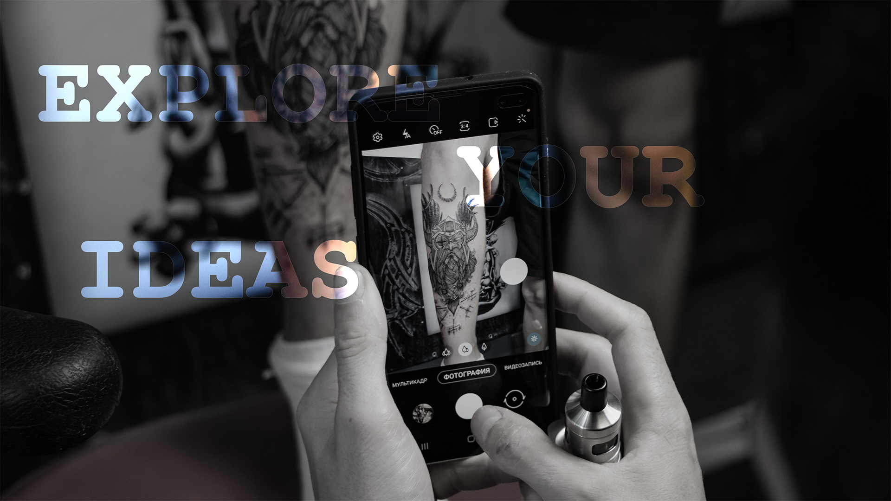

# Welcome to Kingdom Of Shadows!

This website is designed for a [tattoo studio](https://denysrudenko.github.io/Project-1.-Tatto-studio./).

## Introduction
**Kingdom of Shadows** is a tattoo studio that provides variety of services for the clients. The owner is a talented experienced artist, who now wants to attract clients via Internet. As we know having a website is not a key to successful growth, but excellent presentation is. So for me as for developer it is extremely important to define the philosophy of the business and present the work of the studio.

## Table of Contents 

# Table of Contents
 [1. Who will be interested in visiting the website?](#interested)
    - [User experience:](#user-exp)
    - [User Goals:](#user-goals)
    - [User Expectations:](#user-expectations)
    -	[Colour scheme and font](#color-scheme)
    - [Audio/video controls](#audio-video)
    - [Site skeleton (wireframes)](#wireframes)
     - [Introduction page](#introduction-page)
     - [Result](#result)
 [2. Features](#features)
  

# 1. Who will be interested in visiting the website?
  [Go to the top](#table-of-contents)
* potential clients of the studio 
* people looking for inspiration and new technics 
* professionals working in the same industry 
* people, who want to learn more about the technology of tattooing 

## 1.1 User experience 
   [Go to the top](#table-of-contents)

In modern world respectful business must have an on-line page to grow. This especially applies to the tattoo salons, because it is a number one wish for the clients to assure themselves that their expectations meet the reality. 

## 1.2 User Goals
  [Go to the top](#table-of-contents)

My main goal during the project was creation of the strong image of the studio, creating a portfolio to back up the description and giving an overview of the tattooing process. 

## 1.3 User Expectations
   [Go to the top](#table-of-contents)

The website contents the information about studio, background of the artist and detailed description of the styles he uses, services available there, feedback from the clients, contact info. Here is what user is able to do within the website:
* all pages are easily accessible 
* the interface is easily navigated 
* responsive design for all screen/device sizes
* links to the messengers to contact the studio

## 1.4 Color Scheme
  [Go to the top](#table-of-contents)

The choice of the color scheme for the website promoting a business like this plays a huge role in creating the image of the studio in user's eyes. In this design I used Webkit to adjust colors.I style the scroll bar and made a lot of hover effects.

Example:
* background: -webkit-linear-gradient(#bba14f, #f7ef8a, #d2ac47, #edc967);
*   -webkit-background-clip: text;
*   -webkit-text-fill-color: transparent;

## 1.5 Audio-Video-Images
  [Go to the top](#table-of-contents)

Informative and qualitative content for business is one of the best ways to present the work it does. Examples of the work for tattoo saloons are the bridge between klients and business, since many people decide to attend a studio based on the already made designs. My mission was to provide visitors with high resolution pictures, that can be seen and analyzed by the client making a decision. It was also important to display as many different pictures of tattoos as possible, to show divers designs, that artist can do.

What i did?
* Each background image was edited with width and height.
* Each background image was styled with a different style.
* The text of background images were moved for the user accessibility.

## 1.5 Site Skeleton
  [Go to the top](#table-of-contents)

[Wireframe](https://wireframe.cc/) was used to create wireframes of the website. This was very useful as you can quickly make an example of your website.

## Introduction Page

### Desktop
   [Go to the top](#table-of-contents)

* Home page

* Gallery page

* Contact page

### Mobile
   [Go to the top](#table-of-contents)

* Home page

* Gallery page

* Contact page

## Result

### Desktop

* Home page

* Gallery page

* About page

* Contact page

### Mobile

* Home page

* Gallery page

* About page

* Contact page

  
# 2. Features
  [Go to the top](#table-of-contents)
 ### All 4 pages:

- Header contains:
* Logo
* Social links
* Menu button

- Social links is placed at the top in the center of the page,i decided to place them there becouse i was trying to make the similar design as [here](https://dribbble.com/shots/11360956--84-2-Shots-for-Practice/attachments/2973440?mode=media).
- Navigation bar is placed at the top right corner in menu button. I read a lot of material to develop it, i took from one of examples [here](https://freefrontend.com/css-hamburger-menu-icons/). The style of code was changed and edit for my purposes. There was a lot of work making that without a JavaScript.

- Drop down menu bar is slided from the left side and contains :
* Home
* Gallery
* About us
* Contact us

- Logo of Tattoo Studio is placed on the top left corner and has an active selector which changes the color.
- Background color of header is trasparent.
- Social media links (for Facebook, Instagram and WhatsUp) are placed at the top and the bottom of the each page in the header and footer. All the links will open in a new tab. In mobile version the top social links is disabled by using:
* display: none;

- Back to home link provided to each page at the top left corner. This will allow the user to access to the home page in one click.

